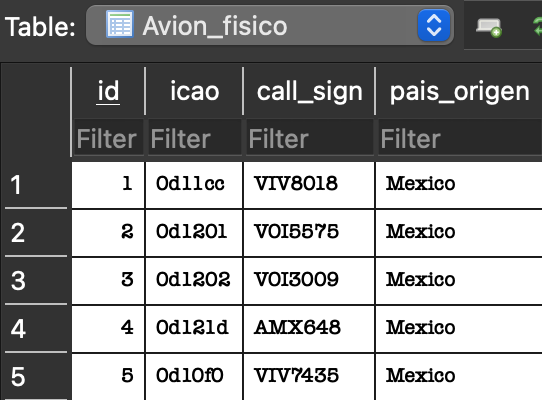
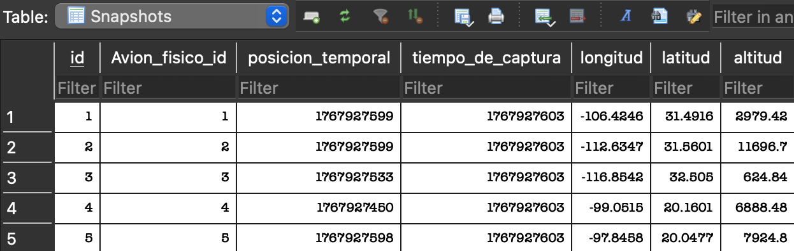
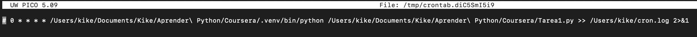
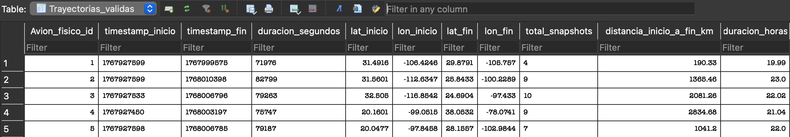

# Airplanes OpenSky Project

---

## Project Description

A project that extracts real-time aircraft state snapshots from the OpenSky Network API and stores them in a SQLite database.  

The main purpose was to demonstrate my learnings from the courses _Python for Everybody_ and W3Schools _SQL_ by building a structured dataset of aircraft observations that can later be used to identify and reconstruct flight trajectories with sufficient observational duration.

All of this is achieved by combining Python scripting, API consumption, SQL-based data modeling, and relational database storage as an end-to-end data ingestion and analysis pipeline.

---

## Objective
The main objectives of this project are:

- Consume an external aviation API using authenticated requests
- Collect aircraft state snapshots in a structured way
- Store flight data in a local SQLite database
- Build a foundation for future flight trajectory reconstruction and analysis
- Practice clean project structure, security best practices, and Git workflows
- Perform post-ingestion data cleaning and transformation using SQL subqueries
- Compute analytical features (such as flight distance and flight duration in hours) from validated trajectories

---

## Project structure
```bash
├── airplane-trajectories-python/
│   ├── Airplanes_ingest_flight_snapshots.py # Main ingestion script
│   ├── Airplanes_compute_flight_snapshots.py # Main analysis script
│   ├── README.md # Project documentation
│   ├── credentials.json # API credentials
│   ├── images # Contains the images that ilustrate this README
└────── .gitignore # Files excluded from version control
```

The `credentials.json` file is intentionally excluded from the repository to protect sensitive information.

---

## General Script Workflow

### Stage 1. Data ingestion and storage carried by `Airplanes_ingest_flight_snapshots.py`

  1. Load API credentials from a local JSON file
  2. Authenticate with the OpenSky API and obtain an access token
  3. Call the OpenSky states endpoint to retrieve aircraft snapshots
  4. Connect to a SQLite database provided by the user
  5. Create the main database table if it does not exist
  6. Insert aircraft snapshot data into the database
  7. Safely close the database connection

#### Expected result

  We end up with two tables:
  - `Avion_fisico`: Stores unique aircraft identifiers and static metadata
  - `Snapshots`: Stores time-stamped geographic position snapshots for each aircraft

### Stage 2. Trajectory validation using SQL subqueries directly on `SQLite`

  1. Group snapshots by aircraft
  2. Filter trajectories with sufficient observational duration
  3. Extract the first and last observed geographic positions for each aircraft
  4. Remove incomplete or noisy trajectories

#### Expected result

  This stage was considered a success when the new table `Trayectorias_validas` was created and contained one row per aircraft with validated trajectories, including:
  - Initial latitude and longitude
  - Final latitude and longitude
  - Temporal span of observations

### Stage 3. Distance computation and analytical enrichment made by `Airplanes_compute_flight_snapshots.py`

  1. Connect to an existing SQLite database
  2. Retrieving validated trajectories from the `Trayectorias_validas` table
  3. Computing the great-circle distance (in kilometers) between the first and last observed positions of each aircraft
  4. Updating the database by filling the column distancia_inicio_a_fin_km

#### Expected result

  I reached a satisfactory conclusion to the project when the distances were calculated and inserted on the new column _distancia_, which allowed me to look back and see that I 
  had transformed raw positional data into a meaningful analytical feature that could (and are intended to) be used for further exploration or modeling once I learn more about how to
  exploit using the API.

---

## Code explanation

  ### Airplanes_ingest_flight_snapshots.py

  #### 1. Credentials Loading
  
  The project requires authentication to access the OpenSky API as described in the [OAuth2 Client Credentials Flow Section](https://openskynetwork.github.io/opensky-api/rest.html)
  
  Credentials are stored locally in a `credentials.json` file, which is read by the function `obtener_credenciales_de_json()`.
  
  Example structure of `credentials.json`:

  ```python
  # Python example
  {
  "clientId": "your_client_id",
  "clientSecret": "your_client_secret"
  }
  ```

  If the file does not exist or credentials are missing, the script exits safely.

  #### 2. API Authentication
  
  Using the provided credentials, the script requests an authentication token through the function `obtener_token()`.
  
  This token is required to perform authenticated requests to the OpenSky API.
  If authentication fails, the script terminates to avoid unnecessary API calls and avoid credit spending.

  #### 3. OpenSky Endpoint Consumption

  The function `llamar_al_endpoint()` is used to query the OpenSky /states/all endpoint.

  This endpoint returns a snapshot of all currently observed aircraft states, including:

  - ICAO address
  - Callsign
  - Position (latitude and longitude)
  - Velocity and altitude
  - Timestamp information

  The script verifies that valid data is returned before continuing.

  #### 4. Database Creation

  The script uses SQLite as a lightweight relational database.
  The database path is provided by the user as a command-line argument.
  
  If the required table does not exist, the function `crear_tabla_principal()` creates it with the appropriate schema.

  #### 5. Flight Snapshot Insertion

  The function `llenar_tabla_en_sqlite()` iterates over the aircraft states returned by the API and inserts each snapshot into the database.
  
  This step transforms raw API data into structured relational records that can later be queried and analyzed.

  ### Trajectory validation using SQL subqueries directly on `SQLite`

  The ingestion script was executed periodically over an extended time window (24 hours) using a scheduled task (crontab), allowing the database to accumulate temporal snapshots of
  aircraft positions that departed from Mexico in a 24 period, rather than a single static observation.
  
  We inserted 1,989 snapshots for 464 different airplanes into the `Avion_fisico` and `Snapshots` tables, respectively; nevertheless, the database contained multiple position records    per aircraft, including noisy, incomplete, or very short-lived observations.

  

  

  Before doing anything with these records, it was necessary to validate which aircraft trajectories were meaningful for analysis.
  This validation was performed directly in SQLite using SQL subqueries, without Python, and allowed me to practice in a closer way the relational thinking and database-level
  transformations that I study in W3Schools.

  Once I introduced this section, I can explain step-by- all that was done and learned.

  #### 1. Automated data collection with crontab

  To capture aircraft trajectories over time, the ingestion script was executed automatically at fixed intervals using crontab, mainly due to the fact that I wanted to insert records
  without having to run the script at a certain hour by myself.

  

  #### 2. Defining what will be considered as a “valid” trajectory to create `Snapshots_validos`
  
  Not all aircraft observations made sense, so I defined that the only trajectories that were useful would be those that:
  - Contained two or more snapshots. An initial and final point, at least
  - Spanned a sufficient temporal interval. The shortest flight that can be taken on Mexico lasts about [20 minutes](https://www.kooxdiving.com/como-llegar-de-cancun-a-cozumel/), so this      was my chosen time to delimiter the records.
  - Had both initial and final geographic positions. There couldn't be NULL values in either the first and last record of an observed aircraft.
    ```sql
    -- SQL example
    CREATE TABLE Snapshots_validos AS
    SELECT *
    FROM Snapshots
    WHERE Avion_fisico_id IN (
        SELECT Avion_fisico_id
        FROM Snapshots
        GROUP BY Avion_fisico_id
        HAVING 
            COUNT(*) >= 2
            AND (MAX(posicion_temporal) - MIN(posicion_temporal)) >= 900
            AND SUM(
                CASE 
                    WHEN latitud IS NULL OR longitud IS NULL THEN 1
                    ELSE 0
                END
            ) = 0
    );
    ```

  This subquery translated into having 1,791 valid snapshots coming from 352 valid aircrafts.

  #### 3. Creating the `Trayectorias_validas` table

  With the clean data, we could then establish one row per each plane that contained their initial and final positions.
  ```sql
    -- SQL example
    WITH tiempos AS (
    SELECT 
        Avion_fisico_id,
        MIN(posicion_temporal) AS ts_inicio,
        MAX(posicion_temporal) AS ts_fin,
        COUNT(*) AS total_snapshots
    FROM Snapshots_validos
    GROUP BY Avion_fisico_id
    ),
    
    inicio AS (
        SELECT 
            s.Avion_fisico_id,
            s.latitud AS lat_inicio,
            s.longitud AS lon_inicio
        FROM Snapshots_validos s
        JOIN tiempos t
            ON s.Avion_fisico_id = t.Avion_fisico_id
           AND s.posicion_temporal = t.ts_inicio
    ),
    
    fin AS (
        SELECT 
            s.Avion_fisico_id,
            s.latitud AS lat_fin,
            s.longitud AS lon_fin
        FROM Snapshots_validos s
        JOIN tiempos t
            ON s.Avion_fisico_id = t.Avion_fisico_id
           AND s.posicion_temporal = t.ts_fin
    )
    
    SELECT
        t.Avion_fisico_id,
        t.ts_inicio AS timestamp_inicio,
        t.ts_fin AS timestamp_fin,
        (t.ts_fin - t.ts_inicio) AS duracion_segundos,
        i.lat_inicio,
        i.lon_inicio,
        f.lat_fin,
        f.lon_fin,
        t.total_snapshots
    FROM tiempos t
    JOIN inicio i ON t.Avion_fisico_id = i.Avion_fisico_id
    JOIN fin f ON t.Avion_fisico_id = f.Avion_fisico_id;
  ```

  ### Airplanes_compute_flight_snapshots.py
  
  The final analytic stage was to make something with all the data that we had retrieved, stored and cleaned. My mind was full of such cool ideas such as making geofences that could       be established for all the 32 states in México and then make a cool graph that showed the distribution of departures and arrivals of flights, but if I am honest with the lector, this      required knowledge of other tools such as Pandas, NumPy, or Matplotlib Lib, and those are libraries that I would like to explore in a future project, once I completed their respective       course.

  Therefore, I chose something more approachable to my level, which was computing the geographic distance between the first and last observed positions of each aircraft.

  #### 1. Connecting to the database

  The script expects a single command-line argument specifying the path to an existing SQLite database.

  Before performing any computation, the script:

  - Validates the number of command-line arguments
  - Establishes a connection to the SQLite database
  - Creates a cursor for executing SQL statements

  #### 2. Retrieval of validated trajectories

  Using a single SQL query, the script extracts for each aircraft:
  - Aircraft identifier (Avion_fisico_id)
  - Initial latitude and longitude
  - Final latitude and longitude

  #### 3. Great-circle distance computation

  By following the instructions of [this video](https://www.youtube.com/watch?v=oWEDaBOA0ZA), I achieved to make the script compute the geographic distance between the initial and final     positions using the spherical law of cosines.

  #### 4. Updating the database

  Once the distance is computed, the script updates the corresponding row in ´Trayectorias_validas´ by filling the column _distancia_inicio_fin_km_

  

  It may caught your atention the existence of the column _duracion_horas_. It was the cherry on top of this project, where I performed a couple SQL statement directly on the database to    incorporate the duration of each trajectory in hours.
  ```sql
  -- SQL example
  ALTER TABLE Trayectorias_validas
  ADD COLUMN duracion_horas REAL;

  UPDATE Trayectorias_validas
  SET duracion_horas = ROUND(duracion_segundos / 3600.0, 2);
  ```

## Tools Used

- **Python 3**
  - File handling (_JSON_ parsing and validation)
  - HTTP requests and API authentication (_requests_)
  - Command-line interfaces (_sys.argv_)
  - Mathematical computation for geospatial analysis

- **SQLite**
  - Relational schema design
  - SQL subqueries for data validation, aggregation and update statements

- **OpenSky Network API**

- **Git & GitHub**
  - Version control and repository management
  - .gitignore and credential protection

- **Unix-based tools**
  - _crontab_ for scheduled and long-running data collection

## How to test this program on your own computer

1. Ensure Python 3 is installed (falta lo de instalar requests)
2. Install the required Python package:
  ```bash
  pip install requests
  ```
3. Clone this repository
  ```bash
  git clone <repository_url>
  ```
4. Create a credentials.json file locally following the example shown in the **Code explanation** section.
5. Run the ingestion script from the command line, specifying the path to the SQLite database you want to create.
  ```bash
  python Airplanes_ingest_flight_snapshots.py path/to/database.db
  ```
  Replace path/to/database.db with the name and extension of your database. For example:
  ```bash
  python Airplanes_ingest_flight_snapshots.py flights_exploratory.sqlite
  ```
6. After running the script, check that the following tables were created and populated:
  - `Avion_fisico`
  - `Snapshots`

## Security Considerations

- API credentials are never committed to the repository
- Sensitive files are excluded using `.gitignore`
- Authentication tokens are handled in-memory only
